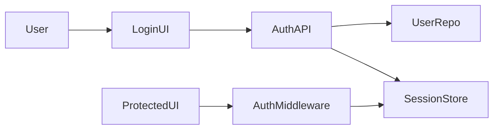

# Architecture: User Login

**Slug:** `user-login`
**Status:** approved
**Gate G3:** ✅ pass

## Summary

POST `/api/auth/login` validates credentials, creates server-side session, returns HTTP-only cookie. Middleware protects routes. Logout clears session.

## System context



## Component breakdown

| Component | Responsibility | Location |
|-----------|----------------|----------|
| LoginForm | Collect email/password | `src/auth/LoginForm` |
| AuthController | Login/logout endpoints | `src/auth/controller` |
| SessionMiddleware | Attach user to request | `src/middleware/session` |
| UserRepository | Lookup + verify password | `src/users/repository` |

## Data model / contracts

### Entities

| Entity | Fields | Notes |
|--------|--------|-------|
| Session | id, user_id, expires_at | Server-side store |
| User | id, email, password_hash | Existing table |

### API contracts

```
POST /api/auth/login
Request:  { "email": string, "password": string }
Response: 200 { "user": { "id", "email" } } + Set-Cookie: session=...

POST /api/auth/logout
Response: 204 + clear cookie
```

## Key decisions (ADR)

### ADR-001: Server-side sessions vs JWT

**Context:** Need revocable sessions and simple logout.  
**Decision:** Server-side session store with HTTP-only cookie.  
**Alternatives considered:** Stateless JWT in localStorage.  
**Trade-offs:** JWT scales horizontally easier but harder to revoke; sessions need store (Redis/DB).  
**Consequences:** Add session table or Redis; middleware checks session on each request.

### ADR-002: Generic error messages

**Context:** Prevent email enumeration.  
**Decision:** Same error for wrong email and wrong password.  
**Alternatives considered:** Specific "email not found" messages.  
**Trade-offs:** Slightly worse UX for typos vs better security.  
**Consequences:** Log detailed reason server-side only.

## Security & permissions

| Action | Actor | Rule |
|--------|-------|------|
| Login | Anonymous | Rate limited |
| Access /dashboard | Authenticated | Session required |

## Dependencies on existing code

- `src/users/repository` — password verify
- `src/middleware/session` — extend if exists

## Implementation notes

- Patterns to follow: existing API error format
- Patterns to avoid: storing passwords in logs

## Gate G3 checklist

- [x] Component breakdown complete
- [x] Data/API contracts defined
- [x] Key decisions have trade-offs documented
- [x] Existing code dependencies identified
