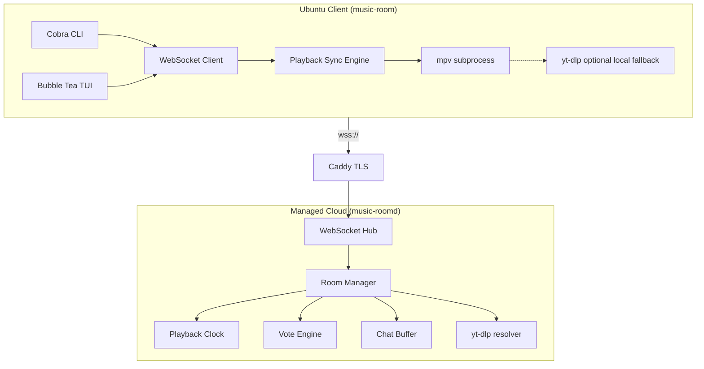
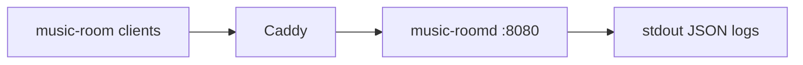

# Architecture: Terminal Music Room

**Slug:** `terminal-music-room`
**Status:** approved
**Gate G3:** ✅ pass

## Summary

Monorepo **Go** gồm hai binary: `music-room` (CLI/TUI client Ubuntu) và `music-roomd` (sync server SaaS). Server **server-authoritative** giữ clock playback, queue, vote, chat; client kết nối qua **WebSocket + JSON**, phát audio **cục bộ** bằng **mpv + yt-dlp** (không relay audio qua server). Mô hình này tối ưu **time-to-release** (một ngôn ngữ, binary đơn, stack terminal đã chứng minh trên Linux) và **ổn định** (mpv/yt-dlp battle-tested; server chỉ điều phối state nhẹ).

**License v1:** MIT  
**Deploy v1:** single-node `music-roomd` behind Caddy (TLS) trên Fly.io hoặc Hetzner VPS

## Recommended tech stack

| Layer | Choice | Rationale (release speed + stability) |
|-------|--------|--------------------------------------|
| **Language** | Go 1.22+ | Một codebase client+server; compile nhanh; RAM thấp; ecosystem CLI/TUI mạnh |
| **Client CLI** | [Cobra](https://github.com/spf13/cobra) | Subcommands chuẩn (`login`, `create`, `join`, `play`, …) |
| **Client TUI** | [Bubble Tea](https://github.com/charmbracelet/bubbletea) + Lipgloss + Bubbles | REQ-016 layout đơn giản; refresh real-time; cộng đồng Go terminal lớn |
| **Transport** | WebSocket (`github.com/coder/websocket`) | Full-duplex, latency thấp, đủ cho 2–20 user/room |
| **Message format** | JSON (shared `internal/protocol`) | Debug dễ, ship nhanh; protobuf defer sau nếu cần |
| **HTTP** | `net/http` + health `/healthz` | TLS termination ở reverse proxy |
| **Server state v1** | In-memory (`map[slug]*Room`) | Không thêm Redis/DB cho v1 → ít moving parts |
| **YouTube metadata** | `yt-dlp` trên **server** (search + resolve) | Rate limit tập trung; client chỉ nhận `video_id` + metadata |
| **Audio playback** | `mpv` subprocess + IPC JSON trên **client** | Ổn định nhất trên Ubuntu; tránh viết audio pipeline Go từ đầu |
| **Config client** | `~/.config/music-room/config.yaml` | Nickname, `server_url`, `session_id` |
| **CI / release** | GitHub Actions → `.deb` + binary `linux/amd64` | `dpkg`/`apt` quen thuộc với Ubuntu target |
| **Observability** | `slog` structured logs + Prometheus metrics (optional v1.1) | Đủ debug sync latency khi ship |

### Explicitly not chosen (v1)

| Option | Why deferred |
|--------|----------------|
| Rust client (Ratatui) | Dev velocity chậm hơn Go cho full v1 feature set |
| Node/TS server | Hai runtime; chia sẻ types kém; audio story phức tạp hơn |
| Server audio relay | Bandwidth/CPU server × N clients; phức tạp sync buffer |
| Redis/Postgres v1 | Room ephemeral; single-node in-memory đủ 2–20 users; thêm sau khi scale |
| gRPC streaming | Overkill; WS JSON đủ AC latency |
| Pure Go audio (`oto` + decode) | Nhiều edge case YouTube; chậm ship |

## System context



## Repository layout (greenfield)

```
terminal-music-room/
├── cmd/
│   ├── music-room/          # Client entrypoint
│   └── music-roomd/         # Server entrypoint
├── internal/
│   ├── protocol/            # WS message types (shared)
│   ├── server/
│   │   ├── hub/             # WS connections, broadcast
│   │   ├── room/            # Room aggregate + invariants
│   │   ├── playback/        # Authoritative clock
│   │   ├── vote/            # Skip + priority votes
│   │   ├── chat/            # Ring buffer messages
│   │   └── youtube/         # yt-dlp wrapper (search, resolve)
│   └── client/
│       ├── ws/              # Reconnect, heartbeat
│       ├── sync/              # Drift correction → mpv
│       ├── player/            # mpv IPC driver
│       ├── tui/               # Bubble Tea model
│       └── cli/               # Cobra commands + REPL mode
├── go.mod
├── Dockerfile.music-roomd
└── packaging/debian/        # .deb metadata + deps: mpv, yt-dlp
```

**Greenfield:** không có application code hiện có — chỉ Vibe DevKit scaffolding. Toàn bộ implementation mới trong layout trên.

## Component breakdown

| Component | Responsibility | Location |
|-----------|----------------|----------|
| **music-room CLI** | Parse args, nickname session, dispatch subcommands | `cmd/music-room`, `internal/client/cli` |
| **music-room TUI** | Layout room/song/queue/members/chat; keyboard input | `internal/client/tui` |
| **WS Client** | Connect, reconnect ≤5m, heartbeat, route events | `internal/client/ws` |
| **Playback Sync Engine** | Map server clock → mpv seek/pause; drift correction | `internal/client/sync` |
| **mpv Player** | Spawn/kill mpv; IPC get position; play YouTube via `--ytdl` | `internal/client/player` |
| **music-roomd Hub** | Accept WS, auth session token, rate limit | `internal/server/hub` |
| **Room Manager** | Slug registry, member cap 20, host transfer, destroy empty | `internal/server/room` |
| **Playback Clock** | Authoritative state machine: playing/paused/buffering/ended | `internal/server/playback` |
| **Queue Service** | Add/remove/reorder; auto-advance on ended | `internal/server/room/queue` |
| **Vote Engine** | Skip + priority; >50% threshold; dedupe votes | `internal/server/vote` |
| **Chat Service** | Broadcast text; system messages; ring buffer last N | `internal/server/chat` |
| **YouTube Resolver** | Search keyword, validate URL, return metadata | `internal/server/youtube` |
| **Protocol** | JSON schemas, validation, error codes | `internal/protocol` |

## Data model / contracts

### Entities (server in-memory)

| Entity | Fields | Notes |
|--------|--------|-------|
| **Session** | `id`, `nickname`, `connected_at`, `last_seen` | Gán khi WS connect; dùng reconnect |
| **Room** | `slug`, `host_session_id`, `created_at`, `members[]`, `playback`, `queue[]`, `chat[]`, `votes`, `reactions` | Xóa khi empty (AC-014) |
| **Member** | `session_id`, `nickname`, `display_name`, `joined_at`, `is_host` | `display_name` disambiguate trùng nickname (AC-016) |
| **PlaybackState** | `status`, `track`, `position_ms`, `anchor_time`, `duration_ms` | `anchor_time` = server monotonic instant khi set `position_ms` |
| **QueueItem** | `id`, `video_id`, `title`, `duration_ms`, `added_by`, `added_at` | |
| **ChatMessage** | `id`, `kind` (user/system), `author`, `body`, `at` | Ring buffer ~100 tin |
| **Vote** | `kind` (skip/priority), `target_id`, `started_at`, `voters[]`, `threshold` | Snapshot N online tại `started_at` |
| **Track** | `video_id`, `title`, `duration_ms`, `source_url` | YouTube only v1 |

### Playback clock (server)

```
effective_position_ms =
  if status == playing:
    position_ms + (now_monotonic - anchor_time)
  else:
    position_ms
```

Server broadcast `playback.tick` mỗi **1s** khi playing + ngay lập tức sau mọi command (play/pause/seek/skip).

Client correction:

```
drift = mpv_position_ms - server_effective_position_ms
if |drift| > 150ms → mpv seek
if status mismatch → pause/play mpv
```

### WebSocket endpoint

```
wss://{saas_host}/v1/ws
```

Query/header (v1):

- `X-Session-Id` (optional reconnect)
- `X-Nickname` (required on first connect)

### Message envelope

```json
{
  "type": "room.join",
  "id": "uuid-correlation",
  "payload": { }
}
```

### Client → Server messages

| type | Payload | Maps to |
|------|---------|---------|
| `session.hello` | `{ "nickname": "kaopiz" }` | REQ-001 |
| `room.create` | `{ "slug": "backend-team" }` | REQ-002 |
| `room.join` | `{ "slug": "backend-team" }` | REQ-003 |
| `room.leave` | `{}` | REQ-004 |
| `playback.play` | `{ "query"?: string, "url"?: string }` | REQ-006 |
| `playback.pause` | `{}` | REQ-007 |
| `playback.resume` | `{}` | REQ-007 |
| `playback.skip` | `{}` | REQ-007 |
| `playback.seek` | `{ "position_ms": 151000 }` | REQ-007 |
| `queue.add` | `{ "query"?: string, "url"?: string }` | REQ-008 |
| `queue.remove` | `{ "item_id": "..." }` | REQ-009 (host) |
| `queue.reorder` | `{ "item_id": "...", "after_id": "..." }` | REQ-009 (host) |
| `chat.send` | `{ "body": "hello" }` | REQ-010 |
| `vote.skip` | `{}` | REQ-011 |
| `vote.priority` | `{ "item_id": "..." }` | REQ-012 |
| `reaction.send` | `{ "emoji": "🔥" }` | REQ-013 |

### Server → Client messages

| type | Payload | Notes |
|------|---------|-------|
| `session.ack` | `{ "session_id", "display_name" }` | |
| `room.snapshot` | Full room state | Gửi sau join + reconnect |
| `room.member_joined` | `{ "member" }` | |
| `room.member_left` | `{ "session_id" }` | |
| `room.host_changed` | `{ "host_session_id" }` | AC-013 |
| `playback.state` | `PlaybackState` | |
| `playback.tick` | `{ "position_ms", "status", "server_time" }` | Sync |
| `queue.updated` | `{ "items": [] }` | |
| `chat.message` | `ChatMessage` | |
| `vote.updated` | `{ "vote", "progress" }` | |
| `reaction.updated` | `{ "counts": { "🔥": 3 } }` | |
| `error` | `{ "code", "message", "retry_after?" }` | |

### Error codes (sample)

| code | HTTP/WS | When |
|------|---------|------|
| `ROOM_NOT_FOUND` | join | AC-008 |
| `ROOM_FULL` | join | AC-009 |
| `SLUG_TAKEN` | create | AC-005 |
| `FORBIDDEN` | queue admin | AC-032 |
| `INVALID_SOURCE` | play | AC-019 |
| `SOURCE_UNAVAILABLE` | play | AC-020 |
| `RATE_LIMITED` | any | NFR-007 |

## Key decisions (ADR)

### ADR-001: Go monorepo (client + server)

**Context:** Cần ship full v1 nhanh với CLI+TUI+realtime server; team nhỏ; Ubuntu-only v1.  
**Decision:** Một monorepo Go: `music-room` + `music-roomd`, shared `internal/protocol`.  
**Alternatives considered:**  
- Rust client + Go server — performance tốt hơn nhưng 2 toolchain, TUI learning curve.  
- TypeScript (Ink) client + Node server — nặng runtime, audio Linux kém mature.  
- Elixir/Phoenix server — channels tuyệt cho realtime nhưng split language với terminal client.  
**Trade-offs:** Go đủ nhanh cho 20 WS/room; không tối ưu raw audio DSP bằng Rust.  
**Consequences:** Một `go test ./...`; release 2 binary từ cùng module; dễ refactor shared types.

### ADR-002: Client-local playback (mpv + yt-dlp), server chỉ sync state

**Context:** REQ-007 đòi sync ≤500ms; NFR-004 RAM client <300MB; clarify chọn stream extraction.  
**Decision:** Server **không** stream audio. Server resolve/search YouTube → phát `video_id` + metadata; mỗi client phát local qua `mpv --ytdl-format=bestaudio` (yt-dlp). Sync engine chỉnh seek/pause theo server clock.  
**Alternatives considered:**  
- Server relay single ffmpeg pipe tới clients — bandwidth O(N), SPOF, latency buffer.  
- Pure Go decode pipeline — nhiều tháng engineering, brittle với YouTube changes.  
- Một client “DJ” phát, peers listen — không democratic playback (vi phạm clarify).  
**Trade-offs:** Mỗi client tải stream riêng (N × bandwidth); chấp nhận được cho 2–20 devs; sync phụ thuộc mpv seek accuracy.  
**Consequences:** Client **bắt buộc** cài `mpv`, `yt-dlp`, `ffmpeg`; document trong `.deb` Depends; disclaimer YouTube ToS trong README.

### ADR-003: WebSocket + JSON thay vì gRPC/protobuf

**Context:** Broadcast room state <500ms; debug nhanh khi ship.  
**Decision:** WebSocket text JSON, envelope `type` + `payload`.  
**Alternatives considered:** gRPC bidirectional stream — schema rigor nhưng chậm iterate; SSE — one-way, không đủ cho commands.  
**Trade-offs:** Payload lớn hơn protobuf; 20 clients vẫn trivial.  
**Consequences:** Version protocol bằng path `/v1/ws`; breaking change → `/v2/ws`.

### ADR-004: In-memory room state (single node v1)

**Context:** Release nhanh; 2–20 users/room; managed SaaS single region.  
**Decision:** `music-roomd` giữ toàn bộ room trong memory; reconnect gắn `session_id` trong 5 phút (AC-048).  
**Alternatives considered:** Redis — persistence across restart nhưng thêm infra; Postgres — overkill cho ephemeral chat/queue.  
**Trade-offs:** Restart server = mất active rooms; chấp nhận cho v1 OSS/SaaS early.  
**Consequences:** Deploy rolling cần maintenance window hoặc graceful drain; roadmap v2: Redis snapshot optional.

### ADR-005: Bubble Tea TUI + Cobra CLI (dual mode, shared WS layer)

**Context:** REQ-015 + REQ-016; UI đơn giản, không polish blocker.  
**Decision:** Cobra cho one-shot commands; `music-room join --tui` mở Bubble Tea; cùng `internal/client/ws` và state store.  
**Alternatives considered:** CLI-only v1 — ship nhanh hơn nhưng thiếu AC-053–055; ncurses thuần — chậm hơn Bubble Tea.  
**Trade-offs:** TUI + mpv subprocess cần thread/model care; patterns Bubble Tea đã chuẩn hóa.  
**Consequences:** Follow `.cursor/skills/` TUI guidance nếu cài `tui-design` / `bubbletea` skills.

### ADR-006: MIT license

**Context:** Clarify yêu cầu open-source v1; dev tool niche.  
**Decision:** MIT.  
**Alternatives considered:** Apache-2.0 (patent grant); AGPL (discourage SaaS closure).  
**Trade-offs:** MIT permissive nhất; ít legal friction cho contributors.  
**Consequences:** SaaS operator vẫn có thể host managed instance; README disclaimer YouTube/yt-dlp compliance.

### ADR-007: YouTube search/resolve on server

**Context:** Abuse control (NFR-007); tránh 20 client gọi yt-dlp search đồng thời.  
**Decision:** Server chạy `yt-dlp` cho `play`/`queue` search và URL validate; clients nhận `video_id`.  
**Alternatives considered:** Client-only yt-dlp — ít server CPU nhưng khó rate limit.  
**Trade-offs:** Server cần cài yt-dlp; CPU spike khi search.  
**Consequences:** Timeout search 10s; cache search results 5 phút in-memory (optional optimization).

## Security & permissions

| Action | Actor | Rule |
|--------|-------|------|
| Set nickname | Anonymous session | 1–32 chars; rate limit 10/min/IP |
| Create room | Authenticated session | Slug unique; rate limit 5/hour/IP |
| Join room | Authenticated session | Max 20 members; no password v1 |
| Play/pause/skip/seek | Room member | Democratic (clarify #8) |
| Add queue | Room member | Valid YouTube source |
| Remove/reorder queue | Host only | AC-032 |
| Chat | Room member | Non-empty; 20 msg/min/member |
| Vote skip/priority | Room member | One vote per vote session |
| Reaction | Room member | Only when track playing |
| WS connect | Any | TLS required; IP rate limit; max 3 sessions/IP |

**Auth v1:** không OAuth — `session_id` UUID lưu local config; reconnect token = session_id.

## Non-functional mapping

| NFR | Architecture approach |
|-----|----------------------|
| NFR-001 Join <2s | WS snapshot 1 round-trip; no DB on join |
| NFR-002 Command <500ms | Hub broadcast fan-out in-process |
| NFR-003 Drift ≤500ms | Server tick 1s + client seek threshold 150ms |
| NFR-004 RAM <300MB | Go binary + mpv idle; no embedded browser |
| NFR-007 Rate limit | Token bucket per IP + per member in hub |
| NFR-008 Ubuntu | Target 22.04/24.04; mpv + yt-dlp from apt |
| NFR-009 OSS | MIT; GitHub public monorepo |

## Dependencies on existing code

| Path | Status |
|------|--------|
| `docs/vibe/001-terminal-music-room/spec.md` | Requirements source — GATE 2 ✅ |
| `docs/vibe/001-terminal-music-room/clarify.md` | Resolved decisions — wins on conflict |
| `docs/spec.md` | PRD reference only |
| Application `src/` | **None** — greenfield project |
| Vibe DevKit (`scripts/vibe.py`, `vibe.config.yaml`) | Pipeline tooling only; không reuse runtime |

## System dependencies (Ubuntu client)

```text
music-room
├── depends: mpv (>= 0.34)
├── depends: yt-dlp (>= 2024.x)
└── recommends: ffmpeg
```

Server (`music-roomd`):

```text
music-roomd
├── depends: yt-dlp
└── recommends: ffmpeg
```

## Deployment (managed SaaS v1)



- **Image:** `FROM golang:1.22-alpine AS build` → distroless/debian slim + yt-dlp binary
- **Host:** Fly.io (1 shared-cpu, 256MB đủ v1) hoặc Hetzner CX22
- **TLS:** Caddy automatic HTTPS
- **Config:** `MUSIC_ROOM_LISTEN=:8080`, `MUSIC_ROOM_MAX_ROOMS=1000`

## Implementation notes

### Patterns to follow

- Server mutations chỉ qua Room aggregate (single goroutine per room hoặc mutex) — tránh race playback
- Idempotent command handling với `id` correlation
- Client: exponential backoff reconnect 1s → 30s, max 5 phút (AC-048)
- System messages cho mọi domain event (AC-035)
- `display_name` = `nickname` + `#` + 4 char session suffix khi trùng

### Patterns to avoid

- Server relay audio stream
- Cho phép client tự báo `position_ms` lên server (chỉ server clock được tin)
- Blocking yt-dlp trên WS read loop — chạy worker pool
- Embed Chromium/CEF cho YouTube

### Suggested skills (optional install)

- `hyperb1iss/hyperskills@tui-design` — TUI layout (REQ-016)
- `samber/cc-skills-golang@golang-cli` + `ggprompts/tfe@bubbletea` — client implementation

### Test strategy (for tasks phase)

- **Unit:** playback clock math, vote threshold, host transfer
- **Integration:** WS hub với fake clients (`httptest` + WS)
- **E2E (manual/scripted):** 2 mpv instances, đo drift — defer automated until stable

## Gate G3 checklist

- [x] Component breakdown complete
- [x] Data/API contracts defined (WebSocket JSON protocol)
- [x] Key decisions have trade-offs documented (ADR-001–007)
- [x] Existing code dependencies identified (greenfield — none)
