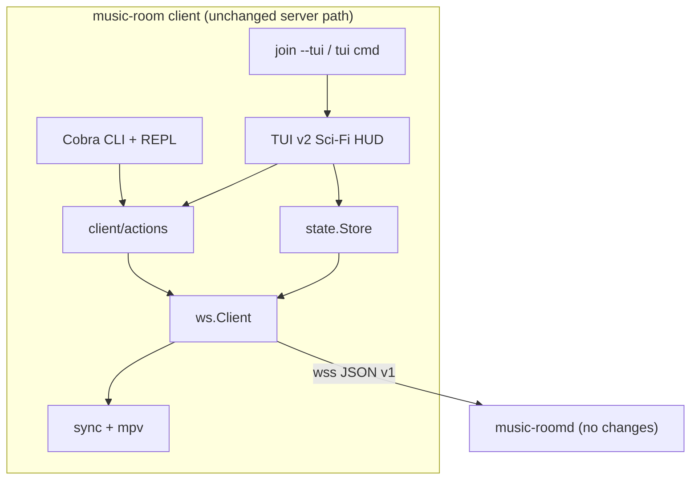

# Architecture: Room Host Sci-Fi TUI (v2)

**Slug:** `room-host-sci-fi-tui`
**Status:** draft
**Gate G3:** ✅ pass

## Summary

Nâng cấp **`internal/client/tui`** (Bubble Tea + Lipgloss) từ layout wireframe v1 lên **HUD cyberpunk thống nhất** cho host và member. **Không đổi server** (`music-roomd`, `internal/protocol`, WebSocket contract v1). Mọi thao tác TUI gửi cùng message types như CLI/REPL; đọc state từ `state.Store` hiện có.

Kiến trúc client TUI v2 tách **4 lớp**: **Theme** (palette 16 màu ANSI), **Layout** (multi-panel responsive), **Panels** (render từng vùng), **Actions** (bridge protocol — tái sử dụng logic REPL). **Modal overlay** cho luồng phụ (thêm bài, kết quả search, seek). **Role gate** tại UI: `SessionID == Room.HostID` mới bật queue admin.

**Entry v2:** `music-room join <slug> --tui` (mặc định **bật TUI**, tắt REPL) + lệnh `music-room tui` khi đã trong room.

## System context



## Component breakdown

| Component | Responsibility | Location |
|-----------|----------------|----------|
| **Join / TUI entry** | Mặc định mở TUI sci-fi sau join; lệnh `tui` cho session đã join | `internal/client/cli/room.go`, `internal/client/cli/tui.go` (new) |
| **TUI root model** | Mode machine: dashboard \| modal \| help; focus panel; quit/leave | `internal/client/tui/model.go`, `update.go` |
| **Theme** | Palette cyberpunk 16 màu ANSI; panel/border/focus/error styles | `internal/client/tui/theme/` |
| **Layout engine** | Tính kích thước panel theo terminal; degrade &lt;80×24 | `internal/client/tui/layout/` |
| **Panels** | Now playing, queue, members, chat, vote, reactions, status bar | `internal/client/tui/panels/` |
| **Modals** | Add/play URL or search, pick search result, seek ms, confirm leave | `internal/client/tui/modals/` |
| **Keymap** | Global shortcuts + context theo focus; help overlay `?` | `internal/client/tui/keys/` |
| **Actions bridge** | Gọi protocol send với validation giống REPL (parity) | `internal/client/actions/` (extract từ `cli/repl_actions.go`, `cli/queue.go`) |
| **State store** | Snapshot room; subscribe refresh (giữ nguyên v1) | `internal/client/state/store.go` |
| **CLI / REPL** | Không regression; dùng chung Actions | `internal/client/cli/*` |
| **Protocol + server** | Không thay đổi | `internal/protocol`, `internal/server/*` |

### Package layout (target)

```
internal/client/
├── actions/              # NEW — shared room commands (play, queue, vote, …)
│   ├── playback.go
│   ├── queue.go
│   ├── social.go
│   └── doc.go
├── cli/
│   ├── room.go           # default --tui true; wire Actions
│   ├── tui.go              # NEW — music-room tui
│   └── repl*.go            # delegate to actions.*
├── state/
│   └── store.go            # unchanged contract
└── tui/
    ├── run.go
    ├── model.go
    ├── update.go
    ├── view.go
    ├── theme/
    │   └── cyberpunk.go    # ANSI palette + lipgloss styles
    ├── layout/
    │   └── hud.go          # 80×24 baseline grid
    ├── panels/
    │   ├── header.go
    │   ├── now_playing.go
    │   ├── queue.go
    │   ├── members.go
    │   ├── chat.go
    │   ├── vote.go
    │   └── reactions.go
    ├── modals/
    │   ├── add_source.go
    │   ├── search_pick.go
    │   └── seek.go
    └── keys/
        └── keymap.go
```

## HUD layout (80×24 baseline)

Persistent **multi-panel** (lazygit-style) — vị trí panel cố định để user xây spatial memory (AC-009).

```
┌─ ◈ ROOM: {slug} ── ONLINE: {n} ── {conn} ─────────────────────────────┐
│ ┌─ NOW PLAYING ─────────┐ ┌─ CREW ────┐ ┌─ SIGNALS ────────────────┐ │
│ │ ▶ {title}             │ │ * host    │ │ SKIP {votes}/{thresh}    │ │
│ │ {bar} {pos}/{dur}     │ │   member  │ │ 🔥3  ❤️2  (reactions)     │ │
│ └───────────────────────┘ └───────────┘ └──────────────────────────┘ │
│ ┌─ QUEUE ───────────────────────────────────────────────────────────┐ │
│ │ › 1. {track} · {added_by}                                         │ │
│ │   2. …                                                            │ │
│ └───────────────────────────────────────────────────────────────────┘ │
│ ┌─ COMMS ───────────────────────────────────────────────────────────┐ │
│ │ {nick}: {msg}  ·  [sys] …                                         │ │
│ └───────────────────────────────────────────────────────────────────┘ │
│ > {input}                                                             │
│ [?]help [p]ause [s]kip [a]dd [v]ote [y]react [d]el* [l]eave  *host   │
└───────────────────────────────────────────────────────────────────────┘
```

| Vùng | AC-009 | Ghi chú |
|------|--------|---------|
| Header | Room slug + online count | Thêm conn badge: `connected` / `reconnecting` (AC-041) |
| Now playing | Bài + tiến độ | Progress bar ASCII `█░`; status playing/paused/buffering |
| Queue | ≥3 mục kế tiếp | Scroll khi focus queue; host: `d` remove, `↑↓` + `m` move |
| Members | Host marker `*` | `DisplayName` ưu tiên (AC-025) |
| Vote + Reactions | Tiến độ vote + emoji counts | Compact panel phải |
| Chat | Tin gần đây + input | Enter gửi chat (giữ v1 behavior) |

**Terminal &lt; 80×24:** `layout.Degraded()` — ẩn chat/vote panel, giữ header + now playing + online (AC-011).

**Unicode box-drawing:** Mặc định `╭╮│─`; fallback `+-|` khi `unicode` disabled hoặc detect broken glyphs (edge case spec).

## Data model / contracts

### Client view model (TUI-only, không gửi server)

| Field | Source | Use |
|-------|--------|-----|
| `View` | `state.Store.Snapshot()` | Toàn bộ render |
| `IsHost` | `view.SessionID == view.Room.HostID` | Bật queue admin UI (AC-037–039) |
| `FocusPanel` | TUI local state | queue \| chat \| members |
| `Mode` | TUI local state | `dashboard` \| `modal_add` \| `modal_search` \| `modal_seek` \| `help` |
| `SelectedQueueIdx` | TUI local | vote priority target, reorder source |
| `ErrToast` | `LastErr` + local validation | Hiển thị dưới input |

Không thêm entity server. Không migration.

### Actions API (new internal package)

Tách từ REPL để TUI và CLI dùng chung — **contract nội bộ Go**, không phải HTTP:

```go
// internal/client/actions — illustrative signatures
type Sender func(ctx context.Context, msgType string, payload any) error

type Room struct {
    Send Sender
    Store *state.Store
}

func (r *Room) Play(ctx context.Context, urlOrQuery string) error
func (r *Room) Pause(ctx context.Context) error
func (r *Room) Resume(ctx context.Context) error
func (r *Room) Skip(ctx context.Context) error
func (r *Room) Seek(ctx context.Context, positionMs int64) error
func (r *Room) QueueAdd(ctx context.Context, urlOrQuery string) error
func (r *Room) QueueRemove(ctx context.Context, itemID string) error  // host check at server
func (r *Room) QueueReorder(ctx context.Context, itemID, afterID string) error
func (r *Room) Chat(ctx context.Context, body string) error
func (r *Room) VoteSkip(ctx context.Context) error
func (r *Room) VotePriority(ctx context.Context, itemID string) error
func (r *Room) React(ctx context.Context, emoji string) error
func (r *Room) Leave(ctx context.Context) error
```

**Mapping → protocol:** giữ nguyên bảng Client→Server trong `docs/vibe/001-terminal-music-room/architecture.md` (playback.*, queue.*, chat.send, vote.*, reaction.send, room.leave).

### TUI Config (extended)

```go
type Config struct {
    Store   *state.Store
    Actions *actions.Room   // replaces raw Send for parity + validation
    Leave   func(ctx context.Context) error
}
```

`Send` thô vẫn có thể wrap bên trong `actions.Room`.

### Server contract

**Không thay đổi** message types, payloads, error codes, permission checks server-side. Lỗi `forbidden` từ server hiển thị trên TUI toast (AC-022).

## Key decisions (ADR)

### ADR-001: Evolve `internal/client/tui` in-place (Bubble Tea)

**Context:** v1 đã ship Bubble Tea + Lipgloss; team và `vibe.config.yaml` đã chọn stack này; spec v2 chỉ đổi presentation + đầy đủ controls.

**Decision:** Refactor và mở rộng package `internal/client/tui` hiện có; **không** tạo binary mới, **không** đổi framework.

**Alternatives considered:**

| Alternative | Rejected because |
|-------------|------------------|
| Ratatui (Rust) rewrite | Hai runtime; không reuse Go client/server |
| Terminal raw ANSI (no framework) | Ship chậm; mất focus/alt-screen helpers |
| Web TUI trong browser | Out of scope spec |
| Package `tui/v2` song song v1 | Duplicate maintenance; clarify yêu cầu thay thế v1 |

**Trade-offs:** (+) Reuse `run.go`, tests, CLI wiring; (−) Refactor `view.go` monolith thành nhiều file.

**Consequences:** Xóa style wireframe cũ (`RoundedBorder`, màu 205/241) sau khi theme mới cover AC-005–007.

---

### ADR-002: Persistent multi-panel HUD + modal overlays

**Context:** AC-009 yêu cầu thông tin chính **luôn hiển thị** trên 80×24; AC-005–023 cần full parity (search, seek, queue admin) — không đủ chỗ cho mọi form inline.

**Decision:** **Dashboard cố định** (header, now playing, queue, members, chat, vote/reactions) + **modal overlay** cho: thêm/phát nguồn, chọn kết quả search, nhập seek ms, xác nhận leave.

**Alternatives considered:**

| Alternative | Rejected because |
|-------------|------------------|
| Tab ẩn (Q/M/C) | Vi phạm AC-009 “không cần tab ẩn” cho thông tin chính |
| Command palette only (như vscode) | Kém discoverable cho user mới; khó đạt “cyberpunk HUD” |
| Full-screen wizard flows | Cắt mất context room khi thao tác |

**Trade-offs:** (+) Đạt AC-009 và parity; (−) Thêm mode state trong model; cần test modal + dashboard transitions.

**Consequences:** `Model.Mode` enum; `Esc` đóng modal về dashboard; dashboard vẫn render mờ phía sau (lipgloss overlay).

---

### ADR-003: Shared `internal/client/actions` package

**Context:** AC-038 full parity host; AC-044 CLI không regression; hiện logic nằm rải rác `repl_actions.go`, `queue.go`, `playback.go`.

**Decision:** Extract **`internal/client/actions`**; REPL và TUI gọi cùng functions; validation (`parseSourceArgs`, empty chat) một chỗ.

**Alternatives considered:**

| Alternative | Rejected because |
|-------------|------------------|
| TUI gọi `Send` trực tiếp duplicate REPL | Drift behavior; khó parity |
| TUI spawn REPL subprocess | UX kém; không sci-fi |
| Embed Cobra commands trong TUI | Cobra không thiết kế cho key events |

**Trade-offs:** (+) Single source of truth; (−) Refactor CLI nhỏ (thin wrappers).

**Consequences:** `repl.go` switch gọi `actions.*`; tests actions package độc lập.

---

### ADR-004: Cyberpunk theme — fixed 16-color ANSI via Lipgloss

**Context:** clarify chọn 16 màu tối thiểu; cyberpunk neon; NFR-006 RAM không tăng >20%.

**Decision:** Palette **cố định** trong `theme/cyberpunk.go` — map semantic roles → ANSI indices (không truecolor):

| Role | ANSI | Mô tả |
|------|------|--------|
| `bg` | 0 (black) | Nền chính |
| `surface` | 235/236 | Panel fill (bright black / gray) |
| `text` | 15 (white) | Nội dung |
| `muted` | 245 | Metadata, help |
| `neon_cyan` | 51 | Tiêu đề panel, HUD accents |
| `neon_magenta` | 201 | Host marker, focus ring |
| `neon_yellow` | 226 | Cảnh báo, vote progress |
| `error` | 196 | Lỗi |
| `success` | 46 | Connected badge |
| `border` | 39 | Box drawing accent |

Borders: **double/light box-drawing** `╭╮╰╯│─` với `BorderForeground(neon_cyan)`; focus panel `BorderForeground(neon_magenta)`.

**Alternatives considered:**

| Alternative | Rejected because |
|-------------|------------------|
| Truecolor gradients | Out of scope; clarify 16-color |
| User-configurable theme file | Out of scope v2 |
| No color (monochrome) | Không đạt AC-006 cyberpunk |

**Trade-offs:** (+) Ổn định trên GNOME Terminal; (−) Không giống hệt CP2077 screenshot.

**Consequences:** Golden tests so sánh snapshot string; manual AC-006 feedback session.

---

### ADR-005: Join defaults to TUI; add `music-room tui` command

**Context:** clarify: join/tui mở sci-fi; hiện `--tui` default `false`, `--repl` default `true`.

**Decision:**

1. `join`: **`--tui` default `true`**; **`--repl` default `false`**; flag `--repl` vẫn tồn tại cho power users.
2. Thêm **`music-room tui`**: connect + yêu cầu đã in-room (hoặc join slug optional `tui [slug]`).
3. `create` **không** auto-TUI v1 — giữ CLI one-shot; user `join --tui` hoặc `create` rồi `tui` (có thể bổ sung `--tui` trên create sau, không blocking v2).

**Alternatives considered:**

| Alternative | Rejected because |
|-------------|------------------|
| Chỉ đổi tên flag | User phải nhớ `--tui` mỗi lần |
| Xóa REPL | AC-044/045 cần CLI+REPL fallback |
| Auto TUI on create | Không clarify; create script-friendly |

**Trade-offs:** (+) Đúng product intent “TUI là trải nghiệm chính”; (−) Breaking change cho user quen `join` → REPL.

**Consequences:** Cập nhật README; test `join` default launches TUI mock.

---

### ADR-006: Keyboard interaction model

**Context:** Full parity cần ~15 actions; 80×24 không đủ toolbar buttons.

**Decision:** **Vim-style global shortcuts** + **focus-aware queue keys**:

| Key | Action | Host only |
|-----|--------|-----------|
| `Space` | pause/resume toggle | |
| `s` | skip | |
| `a` | modal add/play source | |
| `S` (shift+s) | modal seek | |
| `v` | vote skip | |
| `V` | vote priority (selected queue item) | |
| `1`–`4` | quick react 🔥❤️😂👍 | |
| `d` | queue remove selected | ✅ |
| `Ctrl+↑/↓` | reorder selected | ✅ |
| `Tab` / `Shift+Tab` | cycle focus panel | |
| `l` | leave (confirm modal) | |
| `q` | quit TUI **without** leave (AC-004) | |
| `?` | help overlay | |

Chat: focus chat panel + type; `Enter` send (AC-026).

**Alternatives considered:** Mouse support (out of scope); single-line command bar only (không đủ parity).

**Consequences:** `keys/keymap.go` + help panel; host-only keys no-op + toast khi member nhấn.

## Security & permissions

| Action | Actor | Rule | Enforcement |
|--------|-------|------|-------------|
| play/pause/skip/seek | Member, Host | Democratic v1 | Server accepts |
| queue.add | Member, Host | Allowed | Server |
| queue.remove/reorder | Host | Host-only v1 | Server `forbidden`; UI hide/disable (AC-022) |
| chat, vote, react | Member, Host | Allowed | Server |
| leave | Self | Always | Client send `room.leave` |
| TUI quit (`q`) | Self | Thoát UI, **không** leave room | Client local (AC-004) |

Không secrets trong theme/assets. Input chat giới hạn 500 ký tự (giữ `textinput.CharLimit` v1).

## Dependencies on existing code

| Path | Reason |
|------|--------|
| `internal/client/tui/*` | Evolve model/view/update — thay thế layout v1 |
| `internal/client/state/store.go` | Snapshot + `SubscribeRoom` — AC-040 refresh |
| `internal/client/cli/room.go` | Join wiring, default flags (ADR-005) |
| `internal/client/cli/repl.go`, `repl_actions.go`, `queue.go` | Extract to `actions` (ADR-003) |
| `internal/client/cli/runtime.go` | `send`, `requireInRoom`, playback session |
| `internal/client/ws/client.go` | Reconnect UX — status vào header badge |
| `internal/protocol/*` | Message types unchanged |
| `internal/server/*` | **No changes** |

## Implementation notes

### Patterns to follow

- Bubble Tea **Elm architecture**: `Model` / `Update` / `View`; commands cho tick 500ms (giữ v1) + store notify.
- **Render tests** trong `view_test.go`: fixture `state.View` → golden string 80×24 và 120×40.
- **Role từ snapshot**, không cache `IsHost` lâu — cập nhật ngay khi `room.host_changed` (AC-039).
- Lipgloss `JoinHorizontal` / `JoinVertical` như v1; thay `panelStyle` bằng `theme.Panel(focused bool)`.
- Dùng `github.com/mattn/go-runewidth` cho truncate (đã có).

### Patterns to avoid

- Full-screen tick animation hoặc spinner loop (NFR-004).
- Truecolor `lipgloss.AdaptiveColor` — chỉ ANSI index.
- Gửi WS message mới không có trong protocol v1.
- Duplicate permission check chỉ ở UI — vẫn dựa server `forbidden` làm source of truth.

### Refresh & performance

- Giữ `refreshInterval = 500ms` cho playback bar mượt.
- `store.SubscribeRoom` coalesced (đã có) — đủ AC-040 ≤1s.
- Panel list virtualize bằng slice window (queue/members scroll) — tránh allocate mỗi frame.

### Testing strategy

| Layer | Tests |
|-------|-------|
| `theme` | Snapshot style strings; contrast roles defined |
| `layout` | Width/height matrix: 80×24, 120×30, 60×20 degraded |
| `panels` | Unit render với fixture View |
| `actions` | Table-driven — same cases as REPL tests |
| `update` | Key → action → mock Send called |
| E2E manual | AC-006 feedback 3 users; host flow AC-023 |

### Migration / rollout

1. Land `actions` package + REPL refactor (no UI change) — reduces risk.
2. Theme + layout + panels (read-only HUD, chat still works).
3. Keymap + modals + host queue admin.
4. Flip join defaults + `tui` command + README.
5. Remove dead v1 styles từ `view.go` monolith.

## Gate G3 checklist

- [x] Component breakdown complete
- [x] Data/API contracts defined (actions bridge + unchanged WS protocol)
- [x] Key decisions have trade-offs documented (ADR-001–006)
- [x] Existing code dependencies identified
