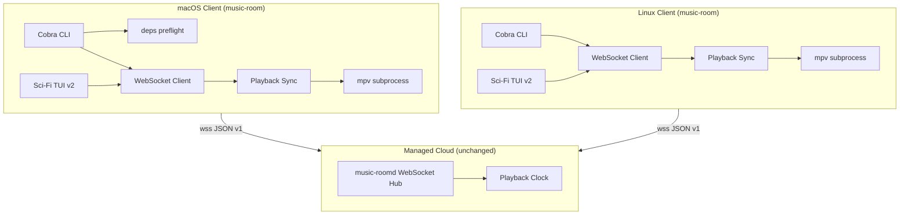

# Architecture: macOS Cross-Platform Support (V0.2.1)

**Slug:** `macos-cross-platform`
**Status:** approved
**Gate G3:** ✅ pass

## Summary

V0.2.1 **mở rộng client** `music-room` sang **macOS (darwin/arm64 + darwin/amd64)** bằng **Go cross-compile** (`CGO_ENABLED=0`) — codebase hiện tại không dùng syscall Linux-specific, không cần fork logic nghiệp vụ. **Server `music-roomd` và giao thức WebSocket JSON v1 không đổi**; cross-platform room hoạt động vì mỗi client phát audio **cục bộ qua mpv** và sync theo **server-authoritative clock** (ADR-001 v1).

Phát hành: **GitHub Release tarballs** (`darwin_arm64`, `darwin_amd64`) + **Homebrew formula** khai báo `mpv`, `yt-dlp`, `ffmpeg`. Không notarize. Thêm module **`internal/client/deps`** để preflight binary + hướng dẫn cài theo OS. CI release workflow mở rộng build matrix; version inject qua **`-ldflags -X main.version=`** từ git tag.

Linux: mở rộng docs + `.deb` hiện có cho **Debian 12+** và derivatives apt-compatible — không redesign packaging.

**Minimum macOS:** 13 Ventura (test matrix); **Terminal reference:** Terminal.app mặc định.

## System context



**Cross-platform invariant:** Server không biết OS client; chỉ điều phối `PlaybackState`, queue, chat, vote. Audio path luôn **local per client** — host macOS không relay audio tới guest Linux.

## Component breakdown

| Component | Responsibility | Location | Change |
|-----------|----------------|----------|--------|
| **music-room client** | CLI + TUI; platform-agnostic Go | `cmd/music-room`, `internal/client/*` | Verify darwin build; minor fixes nếu phát hiện |
| **Dependency preflight** | `exec.LookPath` mpv/yt-dlp; OS-specific install hints | `internal/client/deps/` (new) | **New** |
| **mpv Player** | Subprocess + Unix domain IPC socket | `internal/client/player/mpv.go` | **Reuse** — mpv IPC socket hoạt động trên macOS |
| **Playback Sync** | Drift correction → mpv seek/pause | `internal/client/sync/` | **Reuse** |
| **Sci-Fi TUI** | Bubble Tea HUD 16 màu | `internal/client/tui/` | **Reuse** — test Terminal.app |
| **Config** | `~/.config/music-room/config.yaml` | `internal/client/config/` | **Reuse** — path hợp lệ trên macOS |
| **Protocol + WS** | JSON v1 messages | `internal/protocol`, `internal/client/ws/` | **No change** |
| **music-roomd** | SaaS sync server | `cmd/music-roomd`, `internal/server/*` | **No change** cho cross-platform client |
| **Release — Linux** | tarball + `.deb` amd64 | `.github/workflows/release.yml`, `packaging/` | Giữ; inject version ldflags |
| **Release — macOS** | darwin tarballs + checksums | `.github/workflows/release.yml`, `packaging/build-macos.sh` (new) | **New** |
| **Homebrew** | Formula + optional tap README | `packaging/homebrew/Formula/music-room.rb` (new) | **New** |
| **Docs** | macOS install, Gatekeeper, Debian | `README.md`, `docs/E2E.md`, `docs/PLATFORMS.md` (new, optional) | **Update** |
| **Cross-platform E2E** | Manual + scripted smoke matrix | `docs/E2E.md`, `scripts/e2e-smoke.sh` | **Extend** |

### Repository layout (additions)

```
terminal-music-room/
├── internal/client/deps/
│   ├── deps.go           # Check(), InstallHints()
│   ├── hints_linux.go    # apt one-liner
│   └── hints_darwin.go   # brew one-liner
├── packaging/
│   ├── build-macos.sh    # tar.gz darwin arm64/amd64
│   └── homebrew/
│       └── Formula/
│           └── music-room.rb
└── .github/workflows/
    └── release.yml       # + darwin cross-compile steps
```

## Data model / contracts

### Không thay đổi server contracts

WebSocket endpoint, message envelope, và toàn bộ `room.*` / `playback.*` / `queue.*` / `chat.*` / `vote.*` / `reaction.*` types giữ nguyên theo `docs/vibe/001-terminal-music-room/architecture.md`. Cross-platform clients là **peer OS-agnostic** — cùng `X-Session-Id`, `X-Nickname`, cùng `room.snapshot` semantics.

### Client-only contracts (new)

#### Dependency check result

```go
// internal/client/deps
type CheckResult struct {
    Missing []string          // e.g. ["mpv", "yt-dlp"]
    Hints   map[string]string // binary → install command for current GOOS
}
```

Gọi `deps.Check()` trước `startLocalPlayback()` và trước lệnh `play`/`join` khi playback enabled. Trả về lỗi user-facing nếu `Missing` non-empty (AC-004, AC-029).

#### Release artifact naming (V0.2.1)

| Asset | Pattern | Contents |
|-------|---------|----------|
| Linux tarball | `terminal-music-room_{VERSION}_linux_amd64.tar.gz` | `music-room`, `music-roomd`, `SHA256SUMS` |
| macOS arm64 | `terminal-music-room_{VERSION}_darwin_arm64.tar.gz` | `music-room`, `SHA256SUMS` |
| macOS amd64 | `terminal-music-room_{VERSION}_darwin_amd64.tar.gz` | `music-room`, `SHA256SUMS` |
| Debian packages | `music-room_{VERSION}-1_amd64.deb` | unchanged |

**Note:** `music-roomd` **không** ship trong macOS tarball (spec AC-033 yêu cầu client macOS; server operator vẫn Linux/Docker). Linux tarball giữ cả hai binary.

#### Version injection (build contract)

```bash
VERSION=0.2.1
LDFLAGS="-s -w -X main.version=${VERSION}"
CGO_ENABLED=0 GOOS=darwin GOARCH=arm64 go build -trimpath -ldflags="${LDFLAGS}" -o dist/music-room ./cmd/music-room
```

`cmd/music-room/main.go` đã có `const version = "0.1.0-dev"` — release **phải** override bằng ldflags (AC-034).

#### Homebrew formula contract

```ruby
# packaging/homebrew/Formula/music-room.rb (sketch)
class MusicRoom < Formula
  desc "Synchronized YouTube listening in the terminal"
  homepage "https://github.com/tuanhm-kaopiz/terminal-music-room"
  url "https://github.com/.../releases/download/v#{VERSION}/terminal-music-room_#{VERSION}_darwin_arm64.tar.gz"
  # intel: bottle or separate formula logic via brew dispatch
  depends_on "mpv"
  depends_on "yt-dlp"
  depends_on "ffmpeg"
  def install
    bin.install "music-room"
  end
end
```

Formula **arm64 vs amd64:** dùng `on_arm` / `on_intel` blocks (Homebrew 3+) hoặc hai URL checksum trong một formula — chi tiết implementation trong tasks phase.

## Key decisions (ADR)

### ADR-001: Giữ mpv làm audio backend trên macOS

**Context:** Linux client dùng mpv subprocess + `--ytdl` + IPC JSON (`internal/client/player/mpv.go`). macOS có CoreAudio; có thể viết player native.

**Decision:** **Tiếp tục dùng mpv** trên macOS (cài qua Homebrew). Không đổi sync engine.

**Alternatives considered:**

| Option | Pros | Cons |
|--------|------|------|
| mpv (chosen) | Parity code 100%; battle-tested ytdl; IPC đã implement | User phải `brew install mpv` |
| afplay + extracted file | Không cần mpv | Phải tải file trước; seek/sync phức tạp; không parity |
| libmpv CGO binding | Tích hợp sâu | CGO_ENABLED=1; cross-compile khó; scope lớn |

**Trade-offs:** Chấp nhận dependency ngoài trên Mac (giống Ubuntu apt). Đổi lấy **zero change** trong `internal/client/sync`.

**Consequences:** Homebrew formula `depends_on "mpv"`. Docs macOS liệt kê `brew install mpv yt-dlp ffmpeg`.

---

### ADR-002: Go cross-compile darwin từ CI Linux (CGO_ENABLED=0)

**Context:** Release hiện chỉ build `GOOS=linux` trên `ubuntu-latest`. Cần thêm darwin/arm64 + darwin/amd64.

**Decision:** **Cross-compile darwin trên ubuntu-latest** trong job `release` hiện có. `CGO_ENABLED=0`, `-trimpath`, stripped binaries.

**Alternatives considered:**

| Option | Pros | Cons |
|--------|------|------|
| Cross-compile từ Linux (chosen) | Một runner; nhanh; đủ cho unsigned OSS binary | Không catch macOS-only runtime bugs |
| macos-latest runner build | Native verify | Chi phí CI; 2 macOS arch cần matrix |
| Goreleaser | Nhiều platform tự động | Thêm tool; overkill V0.2.1 |

**Trade-offs:** Thêm job **optional** `test-macos` trên `macos-latest` (go test + tui-smoke với `MUSIC_ROOM_NO_PLAYBACK=1`) để catch darwin compile/test regressions — không block release nếu flaky, nhưng **khuyến nghị** cho review.

**Consequences:** `packaging/build-macos.sh` mirror pattern `build-deb.sh`. Không cần Xcode cho client Go thuần.

---

### ADR-003: Không thay đổi server cho V0.2.1

**Context:** Clarify xác nhận deployment model SaaS không đổi.

**Decision:** **Zero server changes** cho cross-platform. `music-roomd` không nhận biết client OS; không thêm message types.

**Alternatives considered:** Server-side OS telemetry; per-OS feature flags — rejected (scope creep).

**Trade-offs:** Cross-platform bugs nằm ở client audio/deps/TUI — debug bằng mixed-OS E2E.

**Consequences:** Tasks không touch `internal/server/*` trừ khi bugfix không liên quan phát hiện trong review.

---

### ADR-004: Homebrew formula in-repo (không tách tap repo)

**Context:** Spec yêu cầu GitHub Release + Homebrew.

**Decision:** Formula trong `packaging/homebrew/Formula/music-room.rb`, cài bằng:

```bash
brew install tuanhm-kaopiz/tap/music-room
# hoặc phát hành tap từ subdirectory repo qua brew extract / custom tap repo sau
```

**Phase 1 (V0.2.1):** Document `brew install --formula ./packaging/homebrew/Formula/music-room.rb` cho dev; publish **GitHub tap** `homebrew-tap` hoặc `brew tap` trỏ repo — ưu tiên **formula trong monorepo** + release asset URL cố định.

**Alternatives:** Separate `homebrew-terminal-music-room` repo — cleaner tap UX, thêm maintenance.

**Trade-offs:** Monorepo đơn giản hơn cho OSS nhỏ; tap URL cập nhật mỗi release trong formula `url` + `sha256`.

**Consequences:** Mỗi release tag, CI cập nhật checksum trong formula (hoặc script `packaging/homebrew/bump-formula.sh`).

---

### ADR-005: Unsigned binary + documented Gatekeeper bypass

**Context:** Clarify — không notarize V0.2.1.

**Decision:** Ship **unsigned** binaries. README hướng dẫn:

1. System Settings → Privacy & Security → Open Anyway, **hoặc**
2. `xattr -dr com.apple.quarantine /path/to/music-room`

**Alternatives:** Ad-hoc signing với cert cá nhân — vẫn cần Apple ID; defer.

**Trade-offs:** Friction onboarding Mac user; chấp nhận cho dev tool OSS.

**Consequences:** Release notes V0.2.1 warning rõ (AC-032). Không invest notarization pipeline.

---

### ADR-006: Debian support = document + validate existing .deb (không fork packaging)

**Context:** Spec mở rộng Debian-based Linux; `.deb` amd64 đã build với `Depends: mpv, yt-dlp`.

**Decision:** **Document** Debian 12 / Mint / Pop!_OS install path (`dpkg -i` hoặc tarball). Chạy smoke trên Debian 12 CI container nếu khả thi. **Không** tạo `.deb` variant riêng cho từng derivative.

**Alternatives:** Universal Linux AppImage — out of scope.

**Trade-offs:** Một số derivative thiếu package — `deps` hints + README troubleshooting.

**Consequences:** README section "Supported Linux distros" (AC-028).

---

### ADR-007: Minimum macOS 13 Ventura

**Context:** Clarify để architecture quyết định minimum version.

**Decision:** **macOS 13+** cho test matrix và docs. Go 1.22 và Bubble Tea hỗ trợ tốt; Terminal.app 13+ đủ ANSI 16 màu.

**Alternatives:** macOS 12 — wider audience; macOS 14 only — hẹp không cần thiết.

**Consequences:** E2E manual test trên Ventura + một bản mới hơn (Sonoma/Sequoia).

---

### ADR-008: Preflight deps module thay vì fail tại mpv spawn

**Context:** AC-004/AC-029 yêu cầu thông báo rõ khi thiếu mpv/yt-dlp. Hiện `player.Start` trả `start mpv: executable file not found` — đủ kỹ thuật nhưng thiếu hướng dẫn cài.

**Decision:** `internal/client/deps` gọi sớm với message:

```
missing dependency: mpv
install on macOS: brew install mpv
install on Ubuntu/Debian: sudo apt install mpv
```

**Alternatives:** Document-only — không đủ AC.

**Consequences:** Wire vào `join`, `play`, `create` khi playback active; skip khi `MUSIC_ROOM_NO_PLAYBACK=1`.

## Security & permissions

| Topic | Rule |
|-------|------|
| **Code signing** | Không V0.2.1 — user trust + Gatekeeper bypass docs |
| **Quarantine** | Browser-downloaded binary có `com.apple.quarantine`; docs hướng dẫn xóa |
| **Config permissions** | Giữ `0o600` file / `0o700` dir (`config.Save`) — áp dụng macOS |
| **Server auth** | Không đổi — session token + nickname; rate limit hub |
| **Supply chain** | `SHA256SUMS` per tarball; Homebrew formula `sha256` pinned URL |

## Dependencies on existing code

| Path | Role in V0.2.1 |
|------|----------------|
| `cmd/music-room/main.go` | Entry; version ldflags target |
| `internal/client/player/mpv.go` | Audio — same on darwin |
| `internal/client/sync/engine.go` | Drift correction — OS agnostic |
| `internal/client/cli/playback_session.go` | Hook `deps.Check` before `player.New` |
| `internal/client/tui/*` | Sci-fi HUD — verify Terminal.app |
| `internal/client/actions/*` | TUI/CLI parity — no change |
| `internal/protocol/*` | WS contract — no change |
| `internal/server/*` | Server — no change |
| `.github/workflows/release.yml` | Extend darwin builds + version ldflags |
| `packaging/build-deb.sh` | Linux .deb — add version ldflags parity |
| `packaging/debian/control` | Template for Debian deps list |
| `README.md` | Ubuntu-only today → add macOS + Debian sections |
| `scripts/e2e-smoke.sh` | Pattern for `command -v` dep checks |
| `scripts/tui-smoke.sh` | Headless TUI — run on `macos-latest` CI |

## Implementation notes

### Patterns to follow

- **CGO_ENABLED=0** cho mọi release binary (đã dùng Linux).
- **Platform hints** qua `runtime.GOOS` trong `deps`, không rải `if darwin` trong business logic.
- **MUSIC_ROOM_NO_PLAYBACK=1** cho CI/TUI smoke trên macOS runner không cài mpv.
- **Bubble Tea** `tea.WithEnvironmentColors()` / theme ANSI — đã 16-color safe (`theme/cyberpunk.go`).
- **mpv socket path** dùng `os.MkdirTemp` — hoạt động trên darwin (`player/mpv.go`).

### Patterns to avoid

- `//go:build linux` trên client packages — sẽ chặn macOS build.
- Bundle mpv/ffmpeg trong tarball — phình release, lệch brew/apt model.
- Server-side audio relay cho cross-platform — phá ADR-001 v1.
- macOS-specific TUI fork — một `internal/client/tui` cho mọi OS.

### Build commands (reference)

```bash
# Local dev — macOS
brew install mpv yt-dlp ffmpeg
go build -o music-room ./cmd/music-room
./music-room --version

# Release slice — all client platforms
./packaging/build-macos.sh 0.2.1
./packaging/build-deb.sh 0.2.1
```

### Cross-platform test matrix (review evidence)

| # | Host OS | Guest OS | Cases |
|---|---------|----------|-------|
| 1 | macOS arm64 | Ubuntu 24.04 | create, play, pause, skip, queue, chat, vote, TUI |
| 2 | Ubuntu 24.04 | macOS arm64 | join, guest controls, host queue admin |
| 3 | macOS amd64 | Debian 12 | smoke join + play |
| 4 | macOS only | macOS only | TUI Terminal.app AC-014 |

Automated: `go test ./...` on `ubuntu-latest` + `macos-latest`; `tui-smoke.sh` on both với `MUSIC_ROOM_NO_PLAYBACK=1`.

### Risk mitigations (from clarify)

| Risk | Mitigation |
|------|------------|
| Gatekeeper | README + release notes (ADR-005) |
| Wrong arch binary | Artifact naming `darwin_arm64` / `darwin_amd64`; docs |
| TUI layout Terminal.app | Manual AC-014; `layout/hud.go` degrade <80×24 |
| yt-dlp version skew | Document minimum versions; same as Linux README |
| Cross-platform drift | Existing sync engine; E2E matrix #1–2 |

## Gate G3 checklist

- [x] Component breakdown complete
- [x] Data/API contracts defined (deps + release naming; server unchanged)
- [x] Key decisions have trade-offs documented (ADR-001–008)
- [x] Existing code dependencies identified
