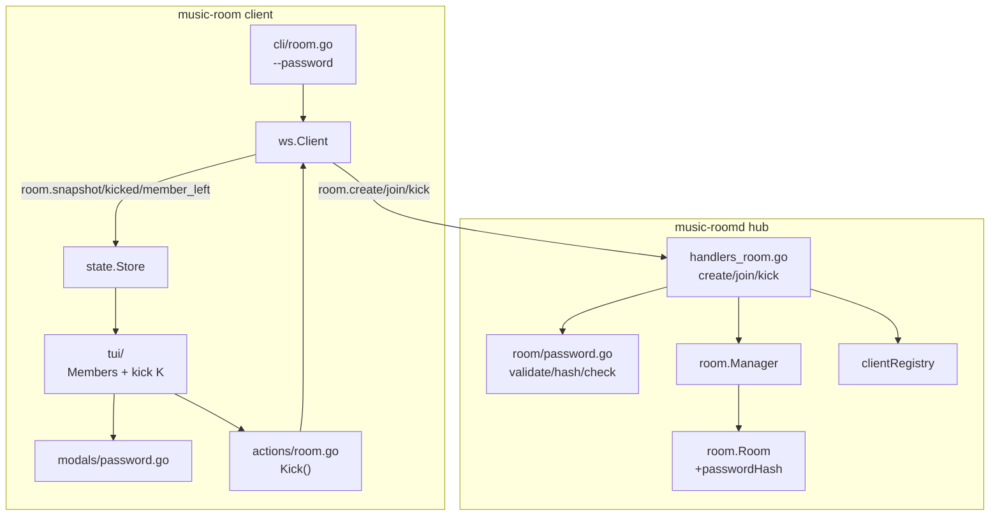
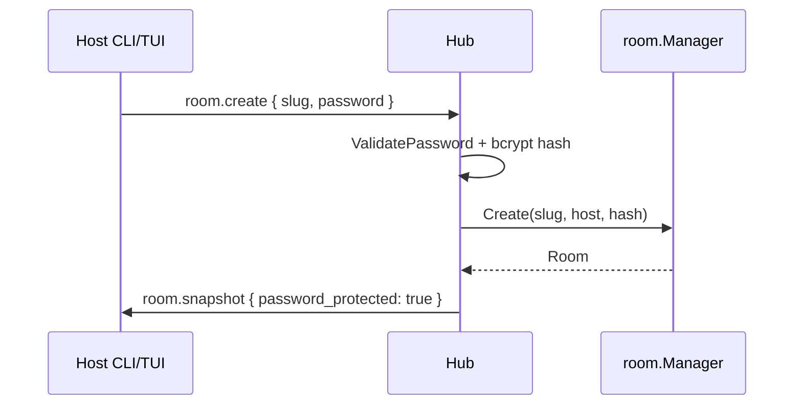
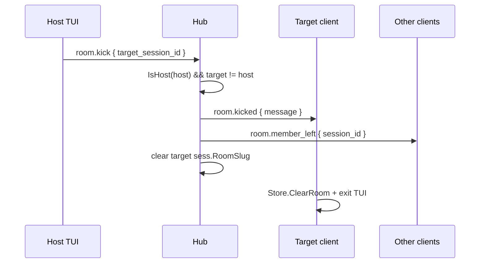

# Architecture: Room Password & Host Kick

**Slug:** `room-password-host-kick`
**Status:** approved
**Gate G3:** ✅ pass

## Summary

Mở rộng **room lifecycle** hiện có (WebSocket JSON `/v1/ws`) với hai capability:

1. **Password tùy chọn** — lưu **bcrypt hash** trên `room.Room` (server-only); client gửi plaintext password một lần trong `room.create` / `room.join`; snapshot chỉ expose `password_protected: bool`.
2. **Host kick** — message mới `room.kick` (host → server) và `room.kicked` (server → target); tái sử dụng `RemoveMember` + `room.member_left` broadcast; kicked client clear room và thoát TUI với message.

CLI thêm `--password`; TUI thêm modal masked password và **member selection** trong panel CREW (song song `selectedQueueIdx`). Không đổi transport, không account system, không Redis.

## System context



**Luồng join có password:** Client gửi `room.join { slug, password }` → hub `CheckPassword` → admit + `room.snapshot` hoặc `error AUTH_FAILED` (không snapshot).

**Luồng kick:** Host TUI `K` → `room.kick { target_session_id }` → hub verify host → `RemoveMember` → `room.member_left` (others) + `room.kicked` (target) → target `Store.ClearRoom()` + TUI exit.

## Component breakdown

| Component | Responsibility | Location |
|-----------|----------------|----------|
| **Password validation** | Trim, reject whitespace-only, length 1–32 | `internal/server/room/password.go` (new) |
| **Password hash/check** | bcrypt hash on create; constant-time compare on join | `internal/server/room/password.go` |
| **Room aggregate** | `passwordHash []byte` (nil = open room); `PasswordProtected()` | `internal/server/room/room.go` (modify) |
| **Manager create** | Accept optional password; hash before register | `internal/server/room/manager.go` (modify `Create`) |
| **Manager join** | Verify password before `AddMember` | `internal/server/room/manager.go` (modify `Join`) |
| **Kick domain** | `KickMember(slug, hostID, targetID)` — host check, not self, remove | `internal/server/room/manager.go` or `room.go` (new method) |
| **WS room handlers** | Password in create/join payloads; new `handleRoomKick` | `internal/server/hub/handlers_room.go` |
| **Forced leave** | `forceLeaveMember` — clear session, broadcast, notify kicked | `internal/server/hub/handlers_room.go` |
| **Protocol types** | Payload fields, message constants, error codes | `internal/protocol/messages.go`, `errors.go`, `types.go` |
| **CLI flags** | `--password` on `create` / `join`; help warning | `internal/client/cli/room.go` |
| **Client actions** | `CreateRoom(slug, pwd)`, `JoinRoom(slug, pwd)`, `Kick(sessionID)` | `internal/client/actions/room.go` |
| **State store** | `applyRoomKicked`; `PasswordProtected` on snapshot | `internal/client/state/store.go` |
| **TUI password modal** | Masked `textinput` (EchoPassword) | `internal/client/tui/modals/password.go` (new) |
| **TUI member select** | `selectedMemberIdx` + highlight row | `model.go`, `update.go`, `panels/members.go`, `panels/options.go` |
| **TUI kick key** | `K` / `Del` when `FocusMembers && IsHost` | `update.go`, `keys/keymap.go` |
| **TUI kicked exit** | `room.kicked` → toast + `tea.Quit` or leave screen | `update.go`, `model.go` |
| **Tests** | Hub integration: password join, wrong pwd, kick, re-join | `handlers_room_test.go`, `integration_test.go`, `room/password_test.go` |

### Package layout (target)

```
internal/
├── protocol/
│   ├── messages.go      # +MsgRoomKick, MsgRoomKicked, payload fields
│   ├── errors.go        # +ErrAuthFailed, ErrAuthRequired
│   └── types.go         # RoomSnapshot +PasswordProtected bool
├── server/
│   ├── room/
│   │   ├── room.go      # +passwordHash []byte
│   │   ├── manager.go   # Create/Join/Kick + password
│   │   ├── password.go  # NEW
│   │   └── password_test.go
│   └── hub/
│       ├── handlers_room.go   # +handleRoomKick, password in create/join
│       └── handlers_room_test.go
└── client/
    ├── cli/room.go
    ├── actions/room.go
    ├── state/store.go
    └── tui/
        ├── modals/password.go   # NEW
        ├── model.go             # +selectedMemberIdx, password modal mode
        ├── update.go            # kick + password flow
        └── panels/members.go    # selection highlight
```

## Data model / contracts

### Server `Room` (extended)

| Field | Type | Notes |
|-------|------|-------|
| `Slug` | `string` | unchanged |
| `HostSessionID` | `string` | unchanged |
| `passwordHash` | `[]byte` | **unexported**; `nil` = open room; bcrypt digest |
| `Members` | `[]protocol.Member` | unchanged |

```go
// room/room.go — illustrative

func (r *Room) PasswordProtected() bool { return len(r.passwordHash) > 0 }

func (r *Room) SetPassword(plain string) error  // validates + bcrypt hash
func (r *Room) CheckPassword(plain string) bool // bcrypt.CompareHashAndPassword
```

**Không** lưu plaintext password trên `Room` sau khi create.

### `RoomSnapshot` (client-visible)

| Field | Type | Notes |
|-------|------|-------|
| `password_protected` | `bool` | `true` iff room có hash; **không** gửi hash hay password |

Các field khác giữ nguyên (`slug`, `host_session_id`, `members`, …).

### Client → server payloads

```json
// room.create
{ "slug": "my-room", "password": "optional-plaintext" }

// room.join
{ "slug": "my-room", "password": "required-if-protected" }

// room.kick (NEW)
{ "target_session_id": "sess_abc..." }
```

| Message | Constant | Sender | Notes |
|---------|----------|--------|-------|
| `room.create` | `MsgRoomCreate` | any session | `password` optional; omit/empty → open room |
| `room.join` | `MsgRoomJoin` | any session | `password` required when room protected |
| `room.kick` | `MsgRoomKick` | host only | immediate, no confirm |

### Server → client payloads

```json
// room.kicked (NEW) — only to kicked session
{ "reason": "removed_by_host", "message": "Removed from room by host" }
```

| Message | When |
|---------|------|
| `room.snapshot` | After successful create/join/reconnect (unchanged + `password_protected`) |
| `room.member_left` | After kick (broadcast to others, exclude kicked) |
| `room.kicked` | Targeted to kicked session **before** or **with** forced leave |
| `error` | Failed join/create/kick with `code` |

### Error codes (new)

| Code | When | Client message (human) |
|------|------|------------------------|
| `AUTH_REQUIRED` | Join protected room without password | "Password required to join this room" |
| `AUTH_FAILED` | Wrong password | "Could not join room" (generic, no leak) |
| `FORBIDDEN` | Non-host kick / kick host / kick self | "Host only" / "Cannot kick this member" |

`AUTH_FAILED` dùng message chung; **không** echo password đúng. Với room không tồn tại: giữ `ROOM_NOT_FOUND` (slug validation trước password check) — joiner biết slug sai sớm; với slug tồn tại + sai password → `AUTH_FAILED` (ADR-003).

### Password validation (shared rules)

```go
// room/password.go

const (
    PasswordMinLen = 1
    PasswordMaxLen = 32
)

// ValidatePassword: non-empty after trim, len 1–32, not whitespace-only
func ValidatePassword(plain string) (string, error)

func HashPassword(plain string) ([]byte, error)   // bcrypt.DefaultCost
func CheckPassword(hash []byte, plain string) bool
```

Dependency: `golang.org/x/crypto/bcrypt` (add to `go.mod`).

## Key decisions (ADR)

### ADR-001: bcrypt hash on server, plaintext only in transit messages

**Context:** Room password bảo vệ session nghe nhạc casual; không có user accounts; v1 in-memory rooms.

**Decision:** Hash password bằng **bcrypt** (`DefaultCost`) khi `room.create`; chỉ lưu `passwordHash` trên `Room`. Client gửi plaintext trong WS payload (TLS ngoài scope v1 — LAN/self-hosted). So sánh bằng `bcrypt.CompareHashAndPassword`.

**Alternatives considered:**
- **Plaintext in memory** — đơn giản nhưng vi phạm NFR-002 và leak risk trong dumps/logs.
- **argon2id** — mạnh hơn, thêm dependency/complexity; overkill cho 1–32 char room password.
- **HMAC(shared secret)** — cần server pepper config; defer.

**Trade-offs:** bcrypt CPU nhẹ trên join; acceptable cho ≤20 members. WS không TLS mặc định — document trong README.

**Consequences:** Thêm `golang.org/x/crypto`; password không có trong snapshot/logs; join latency +~50ms acceptable.

### ADR-002: `password_protected` bool on snapshot, not password hash

**Context:** Client cần biết khi nào prompt password (TUI join flow) mà không lộ secret.

**Decision:** `RoomSnapshot.PasswordProtected bool` — computed từ `len(passwordHash) > 0`. Không field password trên wire sau create.

**Alternatives:** Separate `room.info` pre-join RPC — thêm round-trip; không cần v1.

**Trade-offs:** Joiner chỉ biết room protected **sau** join attempt hoặc nếu có pre-flight — v1: join fail `AUTH_REQUIRED` khi thiếu password đủ cho CLI; TUI prompt trước nếu user chưa cung cấp `--password`.

**Consequences:** TUI `join` flow: nếu không có `--password`, luôn có thể show optional password modal trước send (hoặc send empty → nhận `AUTH_REQUIRED` → modal retry).

### ADR-003: Unified `AUTH_FAILED` for wrong password; `ROOM_NOT_FOUND` unchanged

**Context:** Spec AC-012 cho phép message thống nhất; cần cân bằng security vs debug.

**Decision:**
- Slug không tồn tại → `ROOM_NOT_FOUND` (như hiện tại).
- Slug tồn tại, protected, missing password → `AUTH_REQUIRED`.
- Slug tồn tại, protected, wrong password → `AUTH_FAILED` + message generic.

**Alternatives:** Luôn `AUTH_FAILED` cho cả not-found — che slug enumeration; user chọn giữ phân biệt slug invalid sớm.

**Trade-offs:** Attacker có thể probe slug existence; acceptable cho public slug namespace hiện tại.

**Consequences:** `roomErrorCode` map thêm `ErrAuthFailed`, `ErrAuthRequired` từ `room` package.

### ADR-004: Dedicated `room.kicked` event + reuse `member_left` broadcast

**Context:** Spec AC-021 yêu cầu message rõ cho kicked user; AC-015 yêu cầu others see member gone.

**Decision:**
1. Host `room.kick` → server `KickMember`.
2. Target nhận `room.kicked` (reason + message).
3. Others nhận `room.member_left` (same as voluntary leave).
4. Target: `sess.RoomSlug = ""`, `client.clearRoom()` — **không** gọi `host_changed` (kick không transfer host unless target was host — blocked).

**Alternatives:**
- Chỉ `error` + close WS — đủ disconnect nhưng client khó phân biệt kick vs network.
- Chỉ `member_left` cho tất cả — kicked user không có message riêng.

**Trade-offs:** Thêm message type; client `Apply` case mới.

**Consequences:** `store.applyRoomKicked` sets `InRoom=false`, clears `Room`, sets `LastErr` or dedicated `KickedReason` for TUI banner.

### ADR-005: Member selection index in TUI (mirror queue panel)

**Context:** Panel Members hiện chỉ scroll (`membersScroll`), không có selection.

**Decision:** Thêm `selectedMemberIdx int` trên `tui.Model`; Up/Down khi `FocusMembers` di chuyển selection (clamp 0..n-1); render `>` marker khi selected (giống queue). Host-only: `K` và `Del` gọi `actions.Kick(targetSessionID)`.

**Alternatives:** Modal chọn tên — thêm bước; spec chọn panel + phím.

**Trade-offs:** Kick host row disabled (`member.IsHost` → skip or no-op).

**Consequences:** Sửa `panels/members.go`, `panels/options.go` (`MembersSelectedIdx`), tests trong `focus_test.go`.

### ADR-006: CLI `--password` + TUI modal; defer `--password-stdin`

**Context:** Spec AC-027 cảnh báo shell history; clarify chọn CLI flag + TUI prompt.

**Decision:** Cobra `StringVar` `--password` trên `create` và `join`. Help text cảnh báo history. TUI: `modals.Password` với `textinput.EchoPassword`. **Defer** `--password-stdin` tới backlog trừ khi task nhỏ.

**Alternatives:** Env `MUSIC_ROOM_PASSWORD` — không document v1.

**Trade-offs:** Power users chấp nhận history risk khi dùng flag.

**Consequences:** `runCreate`/`runJoin` pass password vào payload khi flag set; TUI entry có thể prompt trước join nếu flag empty.

### ADR-007: Re-join after kick = full new join (no ban state)

**Context:** Spec AC-023/024; no ban list.

**Decision:** Không server-side kick registry. Kicked session ID có thể `room.join` lại ngay; new `JoinedAt`, vote/reaction state per-session reset khi leave (existing behavior).

**Alternatives:** Session-scoped ban map — out of scope.

**Consequences:** `KickMember` chỉ `RemoveMember`; không side table.

## Security & permissions

| Action | Actor | Rule |
|--------|-------|------|
| Set room password | Host (on create) | Validated 1–32 chars; stored as bcrypt hash only |
| Join open room | Any authenticated session | No password field required |
| Join protected room | Any session | `CheckPassword` must pass |
| Kick member | Host only | `Room.IsHost(sess.ID)`; target ≠ host; target in room |
| Kick self | Host | **Denied** (`FORBIDDEN`) |
| Kick by member | Non-host | **Denied** (`FORBIDDEN`) |
| View room password | Anyone | **Denied** — not in snapshot, logs, or TUI panels |
| Re-join after kick | Former member | Allowed if password correct |

**Logging:** Hub debug logs **must not** include password plaintext or bcrypt hash. Log slug + session_id only.

**Transport:** v1 WS cleartext — password visible on wire; document risk; TLS termination external if needed.

## Sequence diagrams

### Create protected room



### Join with wrong password

```mermaid
sequenceDiagram
    participant J as Joiner
    participant Hub
    participant Mgr as room.Manager

    J->>Hub: room.join { slug, password: "wrong" }
    Hub->>Mgr: Join (pre-check password)
    Mgr-->>Hub: ErrAuthFailed
    Hub->>J: error { AUTH_FAILED }
    Note over J: No snapshot; not in room
```

### Host kick member



## Dependencies on existing code

| Module | Reuse |
|--------|-------|
| `internal/server/room/room.go` | `RemoveMember`, `IsHost`, `FindMember`, `Snapshot` |
| `internal/server/hub/handlers_room.go` | `leaveRoom`, `broadcastToRoom`, `sendSnapshot`, `sendRoomError` |
| `internal/server/hub/handlers_queue.go` | Pattern `if !r.IsHost(sess.ID) { ErrForbidden }` |
| `internal/server/hub/clients.go` | `clientRegistry.get(sessionID)` for targeted `room.kicked` |
| `internal/protocol/envelope.go` | `NewEnvelope`, correlation IDs |
| `internal/client/cli/runtime.go` | `send`, `waitInRoom`, `lastServerError` |
| `internal/client/state/store.go` | `applyMemberLeft`, `ClearRoom` pattern from reconnect |
| `internal/client/tui/modals/add_source.go` | Modal + `textinput` overlay pattern |
| `internal/client/tui/update.go` | `selectedQueueIdx` / focus patterns |
| `internal/client/tui/keys/keymap.go` | `RequireHost()` for kick binding |
| `docs/vibe/002-room-host-sci-fi-tui/` | Panel Members layout baseline |

## Implementation notes

### Patterns to follow

- Domain errors in `room/errors.go`: `ErrAuthFailed`, `ErrAuthRequired`; map in `roomErrorCode`.
- Hub handler shape giống `handleRoomJoin` — parse payload, guard session state, delegate manager, side-effects (broadcast).
- TUI host gating: client-side `IsHost()` + server `FORBIDDEN` (defense in depth).
- Tests: table-driven `password_test.go`; hub test wrong password không tăng `MemberCount`.

### Patterns to avoid

- Đừng thêm `password` vào `RoomSnapshot` hoặc chat system messages.
- Đừng kick bằng cách gọi `leaveRoom` từ phía target (target không consent) — server-initiated `forceLeaveMember`.
- Đừng block re-join bằng map kicked sessions — out of scope v1.
- Đừng dùng rate limiter cho wrong password v1 (spec FR-012).

### Suggested implementation order (for tasks phase)

1. `room/password.go` + tests  
2. Protocol types + errors  
3. `Room` + `Manager` create/join password  
4. Hub handlers create/join  
5. Hub `room.kick` + `room.kicked`  
6. Client store + actions  
7. CLI `--password`  
8. TUI password modal + join/create integration  
9. TUI member selection + kick key  
10. Integration tests E2E hub

## REQ traceability (architecture layer)

| Spec REQ | Architecture touchpoints |
|----------|-------------------------|
| REQ-001 | `Manager.Create`, `RoomCreatePayload`, CLI/TUI create |
| REQ-002 | `Manager.Join`, `RoomJoinPayload`, password modal |
| REQ-003 | `CheckPassword`, `ErrAuthFailed` |
| REQ-004 | `handleRoomKick`, `selectedMemberIdx`, key `K` |
| REQ-005 | `IsHost` server + TUI `RequireHost` |
| REQ-006 | `room.kicked`, `applyRoomKicked`, re-join via normal `Join` |
| REQ-007 | bcrypt hash, masked modal, CLI help, no snapshot leak |

## Gate G3 checklist

- [x] Component breakdown complete
- [x] Data/API contracts defined (protocol + Room model)
- [x] Key decisions have trade-offs documented (ADR-001–007)
- [x] Existing code dependencies identified
