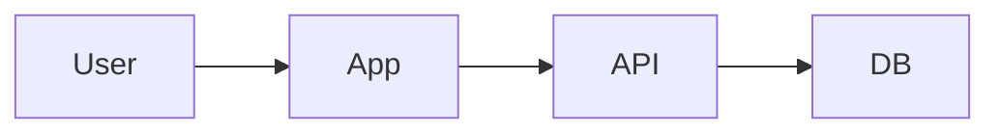

# Architecture: {feature-name}

**Slug:** `{slug}`
**Status:** draft | approved
**Gate G3:** ⬜ pending | ✅ pass | ❌ fail

## Summary

One paragraph technical approach.

## System context



## Component breakdown

| Component | Responsibility | Location |
|-----------|----------------|----------|
| | | |

## Data model / contracts

### Entities

| Entity | Fields | Notes |
|--------|--------|-------|
| | | |

### API contracts (if applicable)

```
POST /api/...
Request:  { }
Response: { }
```

## Key decisions (ADR)

### ADR-001: {decision title}

**Context:**  
**Decision:**  
**Alternatives considered:**  
**Trade-offs:**  
**Consequences:**  

## Security & permissions

| Action | Actor | Rule |
|--------|-------|------|
| | | |

## Dependencies on existing code

- `path/to/module` — reason
- 

## Implementation notes

- Patterns to follow:
- Patterns to avoid:

## Gate G3 checklist

- [ ] Component breakdown complete
- [ ] Data/API contracts defined (if applicable)
- [ ] Key decisions have trade-offs documented
- [ ] Existing code dependencies identified
